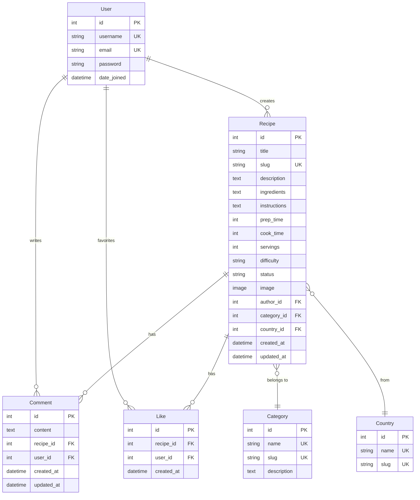

# Database Schema - Entity Relationship Diagram

## Model Relationships

### **User Model** (Django built-in)
- **One-to-Many** with Recipe (one user creates many recipes)
- **One-to-Many** with Comment (one user writes many comments)
- **One-to-Many** with Like (one user likes many recipes)

### **Recipe Model**
- **Many-to-One** with User (many recipes belong to one author)
- **Many-to-One** with Category (many recipes in one category)
- **Many-to-One** with Country (many recipes from one country)
- **One-to-Many** with Comment (one recipe has many comments)
- **One-to-Many** with Like (one recipe has many likes)

### **Category Model**
- **One-to-Many** with Recipe (one category has many recipes)

### **Country Model**
- **One-to-Many** with Recipe (one country has many recipes)

### **Comment Model**
- **Many-to-One** with Recipe (many comments on one recipe)
- **Many-to-One** with User (many comments by one user)

### **Like Model**
- **Many-to-One** with Recipe (many likes on one recipe)
- **Many-to-One** with User (many likes by one user)
- **Unique Constraint**: One user can only like a recipe once

## Key Features
- **Cascading Deletes**: When a recipe is deleted, all associated comments and likes are deleted
- **Unique Constraints**: Usernames, emails, slugs are unique
- **Status Field**: Recipes can be 'draft' or 'published'
- **Timestamps**: All models track creation and update times
